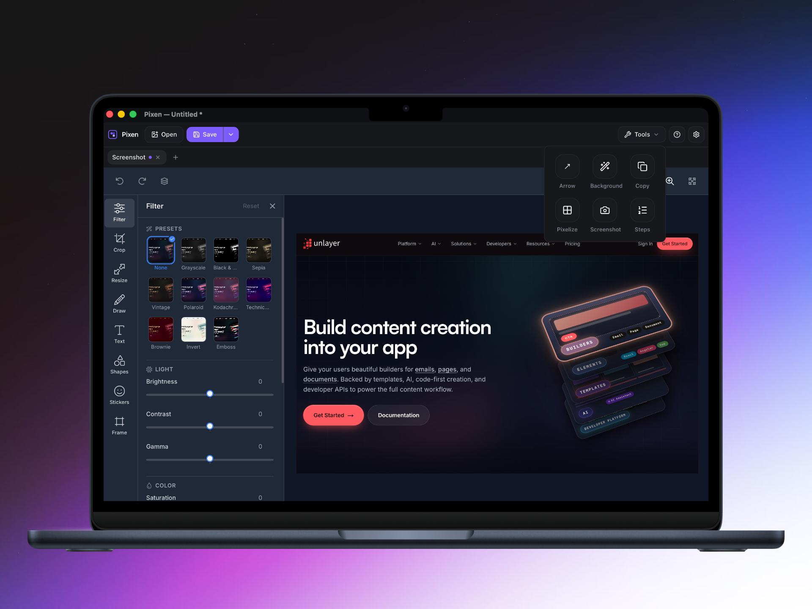

<p align="center">
  
</p>

<h1 align="center">
  Pixen
</h1>
<p align="center">An open-source desktop image editor, ideal for screenshots — crop, annotate, hide private information, and make quick edits.</p>



Pixen is a small desktop shell around the [Unlayer Image Editor](https://unlayer.com/image-editor).
The editor does the editing. Pixen owns the window, the native file dialogs, the encoding, and the keyboard shortcuts.

## What it does

- Opens PNG, JPEG and WebP images by dropping them on the window, pasting from the clipboard, or through a native file dialog. A clean tab is replaced; a dirty one stays and a new tab opens. The tab strip’s **+** always opens another tab.
- Captures a region of the screen straight into the editor, from the toolbar or from the menu bar
- Lives in the menu bar as well as the Dock: click the icon or press `⌘⇧9` from any app to capture, right-click it for **Take Screenshot**, **Start at Login**, **About** and **Quit**. The capture shortcut can be rebound in Settings
- Reopens the last ten images from **File → Open Recent**
- Edits them with [`@unlayer/react-image-editor`](https://github.com/unlayer/react-image-editor) — crop, resize, filters, draw, text, shapes, stickers and frames. Double-click inside a crop to apply it.
- Chooses a light or dark theme in Settings — Pixen’s chrome and the image editor; the choice is remembered in `localStorage`
- Saves as PNG, JPEG or WebP with `⌘S`, asking where to write the first time and reusing that destination afterwards
- Saves to a new file with `⌘⇧S`
- Copies the edited image to the system clipboard with `⌘⇧C`
- Hides private data — an address, a token, a face — behind a mosaic, by dragging a box over it
- Numbers a screenshot for a step-by-step guide: click each spot and the badge counts itself up
- Points at what matters: drag an arrow towards it, as many as the guide needs
- Cuts the background away from the subject with a local segmentation model, previewing the result before it is applied

## Tech stack

- [Tauri](https://tauri.app) 2 for the native shell, windows and filesystem access
- React 19 + TypeScript + Vite for the UI
- Tailwind CSS 4, with [shadcn/ui](https://ui.shadcn.com) primitives in `src/components/ui/`
- [`@unlayer/react-image-editor`](https://www.npmjs.com/package/@unlayer/react-image-editor) as the
  editing engine
- [`@imgly/background-removal`](https://www.npmjs.com/package/@imgly/background-removal) on
  `onnxruntime-web` for background removal — see [License](#license), it is AGPL
- Vitest for unit tests

## Supported platforms

| Platform | Status                                        |
| -------- | --------------------------------------------- |
| macOS    | 10.15+, unsigned `.dmg` from the tag workflow |

## Requirements

- macOS 10.15+
- [pnpm](https://pnpm.io) 10
- Node.js 20+
- Rust 1.77.2+ (`rustup`)
- Xcode Command Line Tools (`xcode-select --install`)

## Development

```bash
pnpm install
pnpm assets:bg-removal
source "$HOME/.cargo/env"
pnpm tauri:dev
```

`assets:bg-removal` downloads the segmentation model into `public/bg-removal/` (76 MB, gitignored).
It is needed once per checkout, and only for the background removal tool — everything else works
without it. `tauri:build` runs it for you.

Rust must be on your `PATH`. If `cargo` is missing in an already-open terminal, run
`source "$HOME/.cargo/env"` or open a new tab.

`pnpm dev` starts the Vite UI only. Every Tauri call fails there, so use `pnpm tauri:dev` for the
real app.

Pixen loads the editor engine from `cdn.unlayer.com`, so the first launch needs an internet
connection.

## Scripts

| Script              | Description                                       |
| ------------------- | ------------------------------------------------- |
| `tauri:dev`         | Run the desktop app                               |
| `tauri:build`       | Build the macOS `.app` and `.dmg`                 |
| `dev`               | Vite UI only (no native shell)                    |
| `build`             | Type-check and build the frontend                 |
| `assets:bg-removal` | Download the background removal model to `public` |
| `test`              | Run Vitest                                        |
| `typecheck`         | `tsc --noEmit`                                    |
| `lint`              | ESLint                                            |
| `format`            | Prettier                                          |
| `icons`             | Regenerate app icons from the SVG                 |
| `clean`             | Remove `dist`, `node_modules`, Rust `target`, …   |
| `check:fix`         | Format, lint, type-check, and test                |

## Build

```bash
pnpm tauri:build
```

Bundles land in `src-tauri/target/release/bundle/` as a `.app` and a `.dmg`. Builds are unsigned, so
the first launch is right-click the app → Open.

Pushing a `v*` tag runs the release workflow on macOS and attaches a universal `.dmg` to the GitHub
Release.

## How it works

Why a drop is not an HTML5 drop zone, why encoding is in Rust, and what a flattened save costs: [docs/how-it-works.md](./docs/how-it-works.md).

## Keyboard shortcuts

The same list is in the app: the **?** button next to Settings.

| Shortcut | Action                          |
| -------- | ------------------------------- |
| `⌘S`     | Save                            |
| `⌘⇧S`    | Save As                         |
| `⌘O`     | Open an image                   |
| `⌘V`     | Open the image on the clipboard |
| `⌘⇧C`    | Copy the image to the clipboard |
| `⌘⇧A`    | Arrow                           |
| `⌘⇧P`    | Pixelize                        |
| `⌘⇧N`    | Numbered steps                  |
| `⌘⇧B`    | Remove background               |
| `⌘⇧9`    | Take a screenshot, from any app |
| `⌘Q`     | Quit, guarding unsaved work     |
| `⌘W`     | Close the About window          |
| `Escape` | Close the About window          |

`⌘⇧9` is registered system-wide in `src-tauri/src/shortcut.rs`, which is what lets it fire while
another app is in front. During `tauri dev`, macOS may ask for Accessibility permission so the
terminal can register it.

It is also the only shortcut you can change: **Settings → Capture screenshot** records a new combo,
and the **×** puts `⌘⇧9` back. Combos Pixen already answers — Save, Copy Image, the tool shortcuts,
Quit — are refused, as is anything without `⌘`. Everything else in the table is fixed.

## Menu bar

Pixen keeps its Dock icon and editor window and adds a menu bar item next to them. Left-click it to
capture, right-click it for the menu.

| Item              | Action                                             |
| ----------------- | -------------------------------------------------- |
| `Take Screenshot` | Capture into a tab (`⌘⇧9`)                         |
| `Start at Login`  | Toggle launch at login (checked when on)           |
| `About Pixen`     | Open the About window                              |
| `Quit Pixen`      | Quit, still asking about unsaved work first (`⌘Q`) |

A capture from the tray goes through the same session as one from the toolbar, so it replaces a
clean tab, opens a new one next to a dirty one, and asks before dropping unapplied marks.

## License

This project is licensed under the MIT License - see the [LICENSE](./LICENSE) file for details.

Background removal uses [`@imgly/background-removal`](https://github.com/imgly/background-removal-js),
which is **AGPL-3.0**. Pixen's own source stays MIT, but that dependency's terms apply to anyone
distributing a build of Pixen that includes it — IMG.LY sells a commercial licence for use that AGPL
does not cover. Nothing else in the dependency tree is copyleft.
