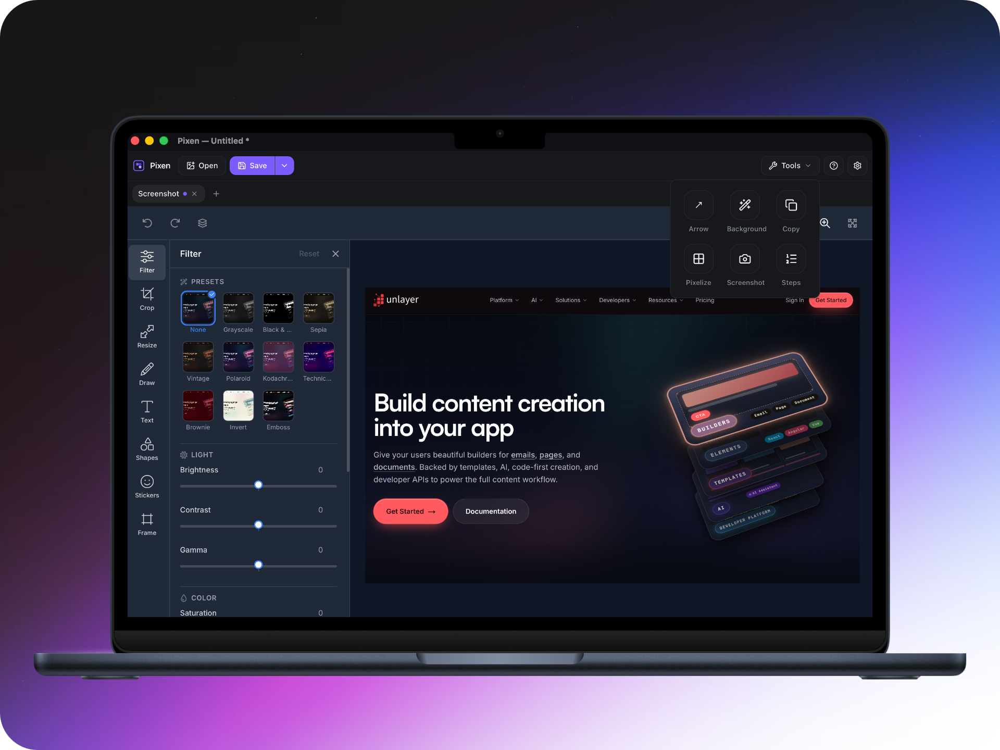
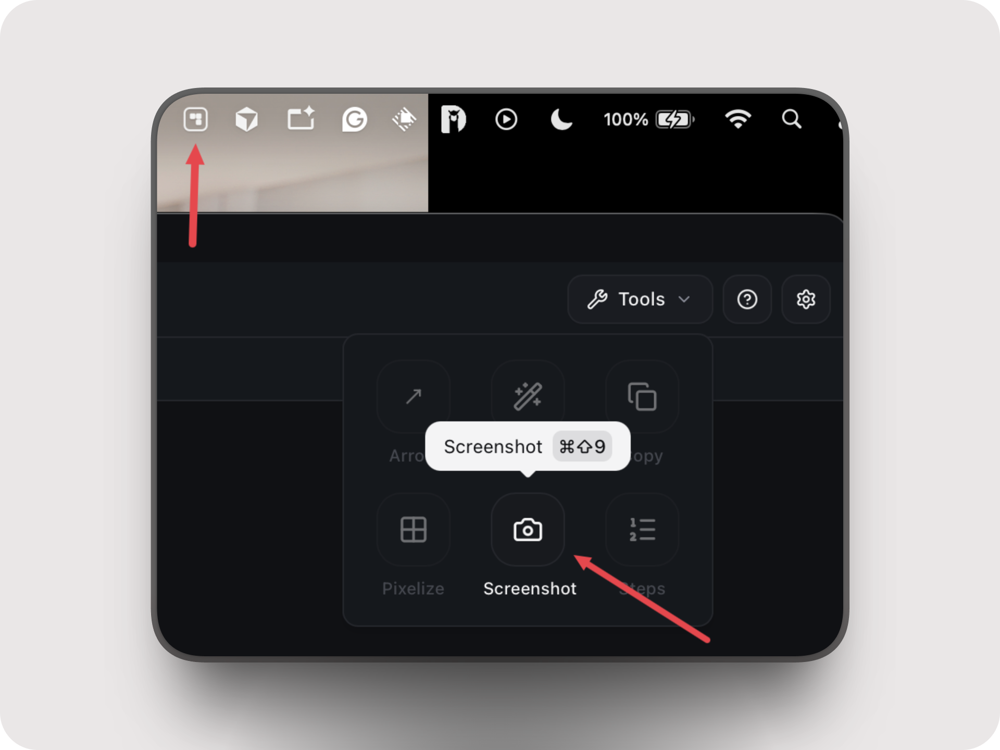
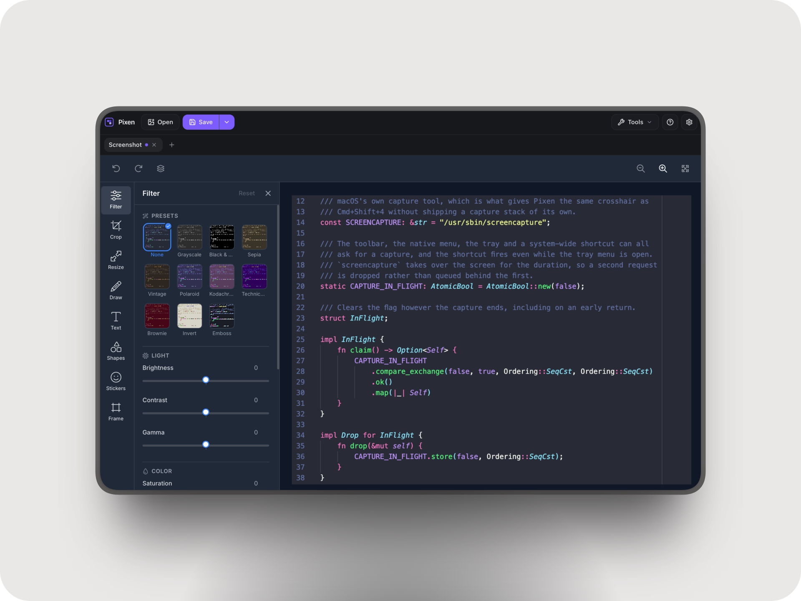
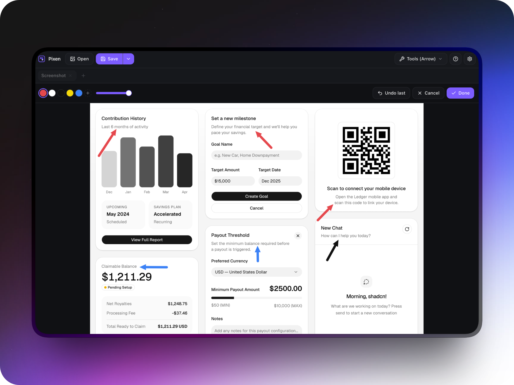
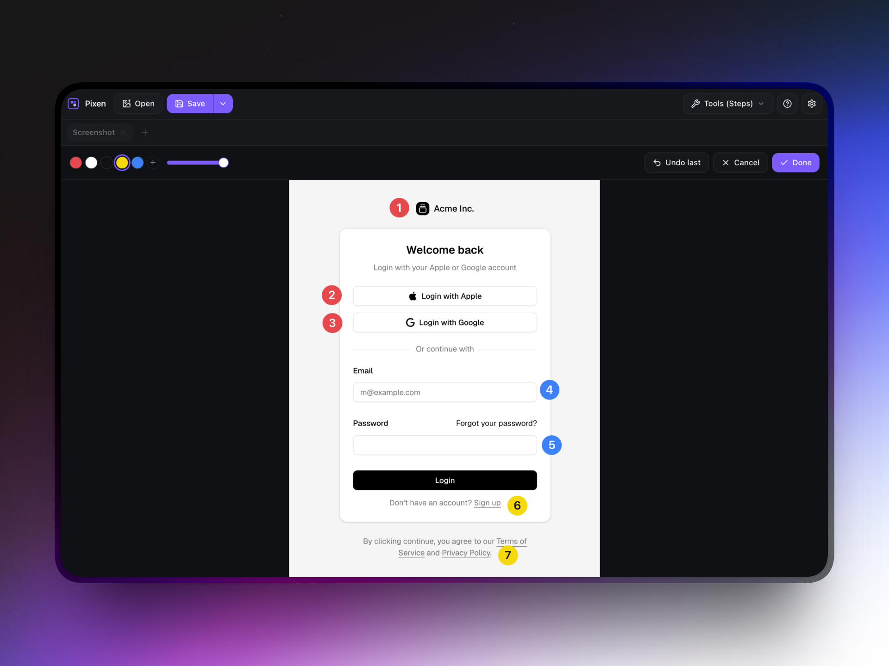
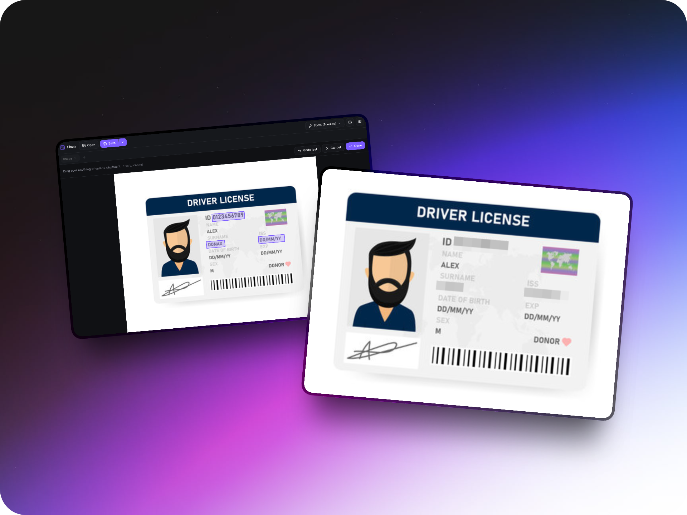
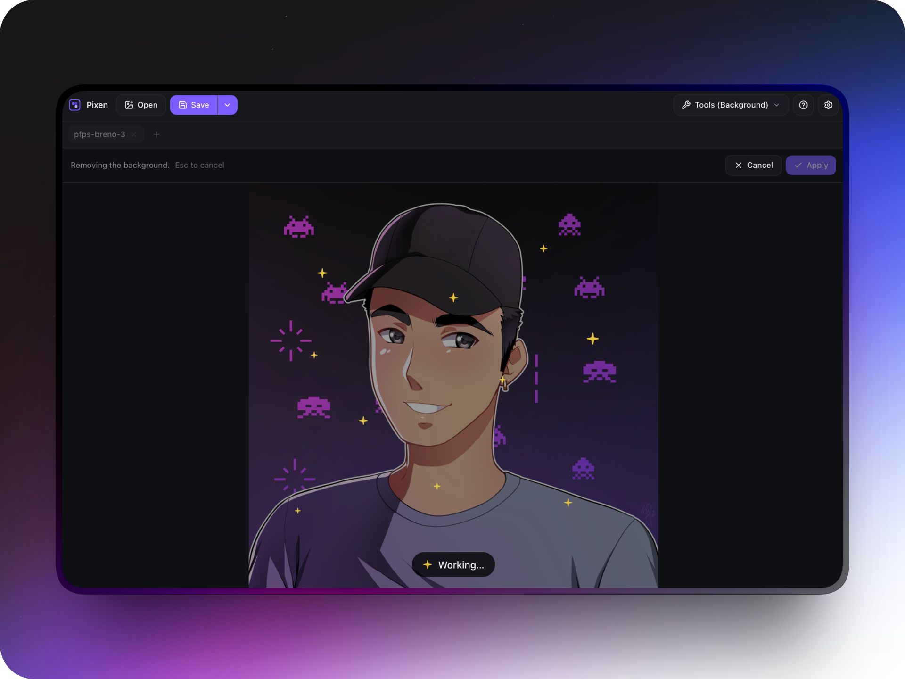

<p align="center">
  
</p>

<h1 align="center">
  Pixen - The Fast, Simple Screenshot Editor
</h1>
<p align="center">Capture, edit, and refine screenshots on your Mac.</p>

<p align="center">
  <a href="https://brenopolanski.com/apps/pixen">Website</a>
  <span>&nbsp;•&nbsp;</span>
  <a href="./docs/how-it-works.md">How it Works</a>
  <span>&nbsp;•&nbsp;</span>
  <a href="https://github.com/brenopolanski/pixen/issues/new?template=support.yml">Contact & Support</a>
  <span>&nbsp;•&nbsp;</span>
  <a href="https://brenopolanski.com/apps/pixen/privacy-policy">Privacy Policy</a>
  <span>&nbsp;•&nbsp;</span>
  <a href="https://brenopolanski.com/apps/terms?from=pixen">Terms of Use</a>
</p>

<p align="center">
  <a href="https://apps.apple.com">
    
  </a>
</p>



Pixen is a lightweight screenshot editor for macOS.

Capture your screen, make quick edits, annotate important details, hide private information, and export the result — all from one simple app.

<!--idoc:ignore:start-->

> [!TIP]
> Press `⌘⇧9` from any app to capture a region straight into the editor. You don't need to switch to Pixen first.

<!--idoc:ignore:end-->

## Features

### Capture Screenshots

Capture any region of your screen directly into Pixen, from the toolbar, the menu bar, or `⌘⇧9`.



### Edit Screenshots

Edit your screenshots with a familiar image editor powered by [Unlayer Image Editor](https://unlayer.com/image-editor).

Crop, resize, apply filters, draw, add text, shapes, stickers, and frames.



### Annotate with Arrows

Point out exactly what matters. Draw arrows anywhere on the screenshot and add as many as you need.



### Add Numbered Steps

Create step-by-step guides directly on your screenshots.

Click each location, and Pixen automatically numbers the markers.



### Hide Private Information

Protect sensitive information before sharing a screenshot.

Pixelate addresses, tokens, faces, and other private data by simply dragging a box over it.



### Remove Backgrounds

Remove the background with a local segmentation model.

The result is previewed before it is applied, and the image never leaves your Mac.



### Menu Bar

Pixen stays in the Dock and adds a menu bar item.

Left-click it to capture. Right-click it to start at login, open About, or quit, without leaving the app you are in.

### Recent Images

Reopen the last ten images from **File → Open Recent**.

### Tabs

Work with multiple images at the same time.

A clean tab can be replaced when opening an image, while a modified tab stays open and a new tab is created.

### Light and Dark Mode

Choose between light and dark mode from Settings.

Pixen's interface and image editor follow your preference, which is remembered between launches.

### Export Anywhere

Save your work as PNG, JPEG, or WebP.

Use `⌘S` to save and `⌘⇧S` to save a new copy. Pixen remembers the destination after the first save.

### Clipboard

Copy your edited screenshot directly to the system clipboard with `⌘⇧C`.

## Tech Stack

- [Tauri](https://tauri.app/) 2 for the native shell, windows, and filesystem access
- React 19 + TypeScript + Vite for the UI
- Tailwind CSS 4 with [shadcn/ui](https://ui.shadcn.com/) primitives
- [`@unlayer/react-image-editor`](https://github.com/unlayer/react-image-editor) as the editing engine
- [`@imgly/background-removal`](https://github.com/imgly/background-removal-js) with `onnxruntime-web` for local background removal
- Vitest for unit tests

## Supported Platforms

| Platform | Status                                        |
| -------- | --------------------------------------------- |
| macOS    | 10.15+, unsigned `.dmg` from the tag workflow |

## Requirements

- macOS 10.15+
- [pnpm](https://pnpm.io) 10
- Node.js 20+
- Rust 1.77.2+ (`rustup`)
- Xcode Command Line Tools (`xcode-select --install`)

## Development

```bash
pnpm install
pnpm assets:bg-removal
source "$HOME/.cargo/env"
pnpm tauri:dev
```

`assets:bg-removal` downloads the segmentation model into `public/bg-removal/` (76 MB, gitignored).

It is needed once per checkout and only for the background removal tool. Everything else works without it. `tauri:build` runs it automatically.

Rust must be on your `PATH`. If `cargo` is missing in an already-open terminal, run:

```bash
source "$HOME/.cargo/env"
```

`pnpm dev` starts the Vite UI only. Tauri APIs are unavailable in that mode, so use `pnpm tauri:dev` for the full application.

Pixen loads the editor engine from `cdn.unlayer.com`, so the first launch requires an internet connection.

## Scripts

| Script              | Description                                       |
| ------------------- | ------------------------------------------------- |
| `tauri:dev`         | Run the desktop app                               |
| `tauri:build`       | Build the macOS `.app` and `.dmg`                 |
| `dev`               | Vite UI only (no native shell)                    |
| `build`             | Type-check and build the frontend                 |
| `assets:bg-removal` | Download the background removal model to `public` |
| `test`              | Run Vitest                                        |
| `typecheck`         | `tsc --noEmit`                                    |
| `lint`              | ESLint                                            |
| `format`            | Prettier                                          |
| `icons`             | Regenerate app icons from the SVG                 |
| `clean`             | Remove `dist`, `node_modules`, Rust `target`, …   |
| `check:fix`         | Format, lint, type-check, and test                |

## Build

```bash
pnpm tauri:build
```

Builds are generated in:

```text
src-tauri/target/release/bundle/
```

The output includes a macOS `.app` and `.dmg`.

Builds are unsigned, so macOS may require you to right-click the app and choose **Open** on first launch.

Pushing a `v*` tag runs the release workflow on macOS and attaches a universal `.dmg` to the GitHub Release.

## How it Works

Pixen combines a lightweight Tauri desktop shell with a web-based image editor.

The native layer handles things such as:

- Window management
- Native file dialogs
- Filesystem access
- Image encoding
- Clipboard integration
- Screen capture
- Global keyboard shortcuts
- Menu bar integration

The editor handles image manipulation and rendering.

For more details, see [How It Works](./docs/how-it-works.md).

## Keyboard Shortcuts

| Shortcut | Action                          |
| -------- | ------------------------------- |
| `⌘S`     | Save                            |
| `⌘⇧S`    | Save As                         |
| `⌘O`     | Open an image                   |
| `⌘V`     | Open the image on the clipboard |
| `⌘⇧C`    | Copy the image to the clipboard |
| `⌘⇧A`    | Arrow                           |
| `⌘⇧P`    | Pixelize                        |
| `⌘⇧N`    | Numbered steps                  |
| `⌘⇧B`    | Remove background               |
| `⌘⇧9`    | Take a screenshot from any app  |
| `⌘,`     | Open Settings                   |
| `⌘?`     | Open keyboard shortcuts         |
| `⌘Q`     | Quit, guarding unsaved work     |
| `⌘W`     | Close the About window          |
| `Escape` | Close the About window          |

`⌘⇧9` is registered system-wide in `src-tauri/src/shortcut.rs`, allowing it to capture the screen while another app is in front.

During `tauri dev`, macOS may ask for Accessibility permission so the terminal can register the global shortcut.

The screenshot shortcut can be changed from **Settings → Capture Screenshot**.

Pixen prevents conflicts with shortcuts it already uses, including Save, Copy Image, tool shortcuts, and Quit. Custom shortcuts must include `⌘`.

## Menu Bar

Pixen lives in both the Dock and the macOS menu bar.

Left-click the menu bar icon to capture a screenshot. Right-click it to access the available actions.

| Item              | Action                           |
| ----------------- | -------------------------------- |
| `Take Screenshot` | Capture into a tab (`⌘⇧9`)       |
| `Start at Login`  | Toggle launch at login           |
| `About Pixen`     | Open the About window            |
| `Quit Pixen`      | Quit while guarding unsaved work |

Captures from the menu bar use the same editing session as captures from the main window.

## License

Pixen is licensed under the GNU Affero General Public License v3.0 (AGPL-3.0). See the [LICENSE](./LICENSE) file for details.

Pixen includes third-party components and dependencies that retain their respective licenses.

In particular:

- [`@unlayer/react-image-editor`](https://github.com/unlayer/react-image-editor) — MIT
- [`@imgly/background-removal`](https://github.com/imgly/background-removal-js) — AGPL-3.0

Third-party components remain subject to their original license terms.
